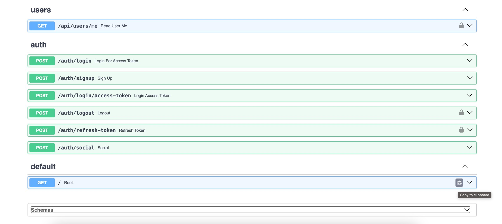

# Chat UI

Author: Adeniyi Aderounmu
Email: teebarg01@gmail.com

## 🚨 Warning: still in construction 😎 🏗️

### Interactive API documentation

[](https://github.com/teebarg/chat-ui)

### Dashboard Login

[](https://github.com/teebarg/chat-ui)

## Technology Stack and Features

- ⚡ [**FastAPI**](https://github.com/teebarg/chat-ui) for the Python backend API.
    - 🧰 [SQLModel](https://niyi.com.ng) for the Python SQL database interactions (ORM).
    - 🔍 [Pydantic](https://docs.pydantic.dev), used by FastAPI, for the data validation and settings management.
    - 💾 [PostgreSQL](https://www.postgresql.org) as the SQL database.
- 🚀 [Nextjs](https://nextjs.org/) for the frontend.
    - 💃 Using TypeScript, hooks and other parts of a modern frontend stack.
    - 🎨 [Tailwindcss](https://tailwindcss.com/) for the frontend styling.
    - 🎨 [Daisy UI](https://daisyui.com/) for the frontend components.
    - 🤖 An automatically generated frontend client.
    - 🦇 Dark mode support.
- 🐋 [Docker Compose](https://www.docker.com) for development and production.
- 🔒 Secure password hashing by default.
- 🔑 JWT token authentication.
- 📫 Email based password recovery.
- ✅ Tests with [Pytest](https://pytest.org).
- 📞 [Traefik](https://traefik.io) as a reverse proxy / load balancer.
- 🚢 Deployment instructions using Docker Compose, including how to set up a frontend Traefik proxy to handle automatic HTTPS certificates.
- 🏭 CI (continuous integration) and CD (continuous deployment) based on GitHub Actions.

## How to use it

You can **just fork or clone** this repository and use it as is.

✨ It just works. ✨

### Configure

You can then update configs in the `.env` files to customize your configurations.

Before deploying it, make sure you change at least the values for:

- `SECRET_KEY`
- `FIRST_SUPERUSER_PASSWORD`
- `POSTGRES_PASSWORD`

### Generate Secret Keys

Some environment variables in the `.env` file have a default value of `changethis`.

You have to change them with a secret key, to generate secret keys you can run the following command:

```bash
python -c "import secrets; print(secrets.token_urlsafe(32))"
```

Copy the content and use that as password / secret key. And run that again to generate another secure key.

### Generate passwords

You will be asked to provide passwords and secret keys for several components. Open another terminal and run:

```bash
openssl rand -hex 32
# Outputs something like: 99d3b1f01aa639e4a76f4fc281fc834747a543720ba4c8a8648ba755aef9be7f
```

Copy the contents and use that as password / secret key. And run that again to generate another secure key.

## Backend Development

Backend docs: [backend/README.md](./backend/README.md).

## Frontend Development

Frontend docs: [frontend/README.md](./frontend/README.md).

## Deployment

Deployment docs: [deployment.md](./deployment.md).

## Development

General development docs: [development.md](./development.md).

This includes using Docker Compose, custom local domains, `.env` configurations, etc.

## License

The Full Stack FastAPI Template is licensed under the terms of the MIT license.
